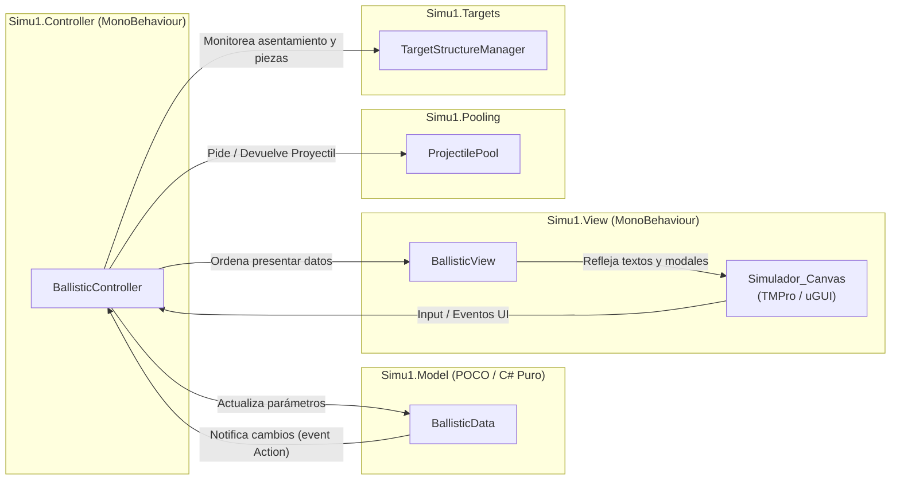

# Simu1 - Simulador Balístico y Físico en Unity

Simulador balístico interactivo y de destrucción estructural por articulaciones físicas (*Joints*), implementado bajo el patrón arquitectónico **MVC (Model-View-Controller)** y optimizado mediante **Object Pooling** en **Unity 6**.

---

## 📌 Especificaciones del Entorno y Versión

* **Motor:** Unity 6 (`6000.3.12f1`)
* **Render Pipeline:** Universal Render Pipeline (URP `17.3.0`)
* **Sistema de Entrada:** Unity New Input System (`com.unity.inputsystem` 1.19.0)
* **UI:** TextMeshPro (`TMPro`) con componentes interactivos uGUI (`Slider`, `Button`, `TMP_InputField`)
* **Framework de Pruebas:** Unity Test Framework (`com.unity.test-framework` 1.6.0)

---

## 🎮 Cómo Jugar

1. **Abrir la escena:**
   - En el explorador de proyectos de Unity, navega a `Assets/Scenes/` y abre **`SampleScene.unity`**.
2. **Iniciar la simulación:**
   - Presiona el botón **Play (▶)** en la barra de herramientas superior del Editor de Unity.
3. **Configurar los parámetros de disparo:**
   - En el panel interactivo ubicado en la esquina inferior izquierda:
     - **Ángulo de Elevación:** Ajusta el slider entre **0° y 90°** (el cañón rotará visualmente en tiempo real).
     - **Fuerza (N):** Ingresa la fuerza del cañón en Newtons (ej. `500` - `800` N).
     - **Masa (kg):** Ingresa la masa del proyectil en kilogramos (ej. `2` - `5` kg).
4. **Efectuar el disparo:**
   - Presiona la **Barra Espaciadora** o haz clic en el botón **`DISPARAR [ESPACIO]`**.
5. **Observar la física e impacto:**
   - El proyectil describirá una trayectoria balística parabólica basada en la gravedad y masa asignada.
   - Al impactar contra la estructura de bloques o dianas:
     - Los bloques unidos por `FixedJoint` se romperán si el impacto supera la fuerza de quiebre.
     - La diana pendular (`HingeJoint`) oscilará al recibir el golpe.
     - La diana elástica (`SpringJoint`) absorberá parte de la energía y rebotará con resorte y amortiguación.
6. **Consultar el Reporte de Tiro:**
   - Al asentarse los escombros de la estructura, se desplegará automáticamente la ventana modal **Reporte de Tiro** en la esquina superior derecha, mostrando la puntuación obtenida, tiempo de vuelo, velocidad relativa, impulso del choque y piezas derribadas.
7. **Reiniciar la prueba:**
   - Haz clic en **`NUEVO INTENTO`** dentro de la ventana de reporte o en **`RESTABLECER ESCENA`** en el panel de control. Todos los proyectiles volverán al pool y la torre se reconstruirá en reposo con cero tensión física.

---

## ⌨️ Controles

| Entrada / Control | Acción | Descripción |
| :--- | :---: | :--- |
| **`Barra Espaciadora (Space)`** | **Disparar** | Dispara un proyectil con los parámetros actuales de ángulo, fuerza y masa. |
| **`Slider de Ángulo`** | **Ajustar Elevación** | Modifica la orientación angular del cañón entre 0° y 90°. |
| **`Campo "Fuerza"`** | **Fuerza en Newtons** | Define la fuerza mecánica aplicada al proyectil durante el recorrido del tubo. |
| **`Campo "Masa"`** | **Masa en Kilogramos** | Asigna la masa inercial ($m$) del proyectil calculada por el motor de físicas. |
| **`Botón DISPARAR`** | **Disparar (UI)** | Alternativa al teclado para lanzar el proyectil desde la interfaz. |
| **`Botón RESTABLECER`** | **Reset Inmediato** | Restaura la torre y recicla proyectiles en cualquier instante sin esperar el reporte. |
| **`Botón NUEVO INTENTO`** | **Continuar / Reset** | Oculta el modal de reporte y prepara la escena para el siguiente lanzamiento. |

---

## 📐 Criterios de Evaluación y Cumplimiento Técnico

### 1. Sistema Balístico y Física Fiel
- **Cálculo de Impulso y Energía:**
  El modelo calcula el impulso inicial según el Teorema del Trabajo y la Energía Cinética:
  $$W = F \cdot d = \Delta E_k = \frac{1}{2} m v^2 \implies v = \sqrt{\frac{2 F d}{m}} \implies I = m v = \sqrt{2 m F d}$$
  Donde $F$ es la fuerza aplicada, $m$ la masa del proyectil y $d$ la longitud efectiva del cañón.
- **Detección Continua:** Rigidbody con `ContinuousDynamic` e interpolación `Interpolate` para evitar el efecto de túnel (*tunneling*) a altas velocidades.
- **Registro de Magnitudes Físicas:** Extracción precisa al momento del impacto de:
  - Tiempo de vuelo ($t$).
  - Velocidad relativa en el choque ($v_{rel}$).
  - Impulso de colisión ($N \cdot s$).
  - Altura máxima alcanzada ($h_{max}$).
  - Coordenadas tridimensionales de impacto $(X, Y, Z)$.

---

### 2. Estructura Articulada con 3 Tipos de Joints
La estructura defensiva (`[Estructura_Objetivos]`) cuenta con 13 piezas articuladas sin colapsos espontáneos en reposo:
1. **`FixedJoint` (Columnas y Dinteles):**
   - Mantiene los bloques rígidos como una sola estructura sólida hasta que el impacto del proyectil supera el umbral de ruptura calibrado (`breakForce` de 600 a 900 N), simulando fractura estructural por estrés mecánico.
2. **`HingeJoint` (Diana Giratoria / Péndulo):**
   - Articulada sobre el eje perpendicular al disparo para balancearse en arco libre al recibir un impacto, equipada con resorte suave (`Spring: 2.5`, `Damper: 0.8`) para amortiguar el balanceo de retorno.
3. **`SpringJoint` (Diana Elástica / Suspensión):**
   - Conexión elástica amortiguada que absorbe energía cinética y oscila tridimensionalmente al ser impactada.
4. **Algoritmo de Reinicio Seguro (Anti-Explosión Física):**
   - Para evitar que los rigidbodies salgan despedidos al reiniciarse, el sistema ejecuta:
     *Paso a Kinematic $\rightarrow$ Reposicionamiento $\rightarrow$ Sincronización con `Physics.SyncTransforms()` $\rightarrow$ Restauración limpia de Joints $\rightarrow$ Retorno a Dynamic*.

---

### 3. Arquitectura de Software MVC (Model-View-Controller)



- **Modelo (`Simu1.Model.BallisticData`):**
  - Clase C# pura (POCO), **sin heredar de `MonoBehaviour`**.
  - 100% testeable mediante pruebas unitarias sin depender del motor gráfico.
  - Notifica cambios exclusivamente a través de eventos estándar de C# (`event Action`).
- **Vista (`Simu1.View.BallisticView`):**
  - Componente estrictamente pasivo; únicamente actualiza textos, sliders e interfaces visuales.
  - No contiene fórmulas físicas ni toma decisiones de simulación.
- **Controlador (`Simu1.Controller.BallisticController`):**
  - Único orquestador que conecta los eventos de la UI con el Modelo, coordina el lanzamiento con el pool y espera el asentamiento físico de los objetivos antes de emitir el reporte.

---

### 4. Rendimiento y Object Pooling (`Simu1.Pooling`)
- **Prohibido `Instantiate`/`Destroy` en caliente:** Todos los proyectiles se obtienen y retornan mediante `ProjectilePool`.
- Los proyectiles reciclan su estado físico y limpian sus eventos en `OnReturnedToPool()`, garantizando cero recolección de basura (*Garbage Collection spikes*) durante las rondas de tiro.

---

### 5. Reporte de Tiro y Puntuación
Al finalizar cada tiro y asentarse los escombros (`IsStructureSettled()`), se calcula la puntuación mediante la fórmula:
$$\text{Puntaje} = (\text{Piezas Derribadas} \times 200) + (\text{Impulso de Choque} \times 10) - (\text{Tiempo de Vuelo} \times 5)$$
El resultado se presenta en la tarjeta modal con formato numérico independiente de la región (`CultureInfo.InvariantCulture`).

---

### 6. Calidad de Código y Pruebas Automatizadas
El proyecto incluye pruebas unitarias ejecutables desde el **Unity Test Runner** (`Window > General > Test Runner`):
- **`BallisticDataTests.cs` (4/4 pruebas aprobadas):**
  - Validación de rangos de ángulo y fuerza.
  - Cálculo de impulso inicial según trabajo y energía.
  - Fórmula de puntuación y registro de magnitudes de impacto.
  - Limpieza de datos en reinicio.
- **`TargetStructureTests.cs` (4/4 pruebas aprobadas):**
  - Estabilidad inicial en reposo (0 derribos prematuros).
  - Detección de caída por límite de altura.
  - Registro de derribo forzado.
  - Restauración y reposicionamiento íntegro de la estructura.

---

## 📁 Estructura del Código Fuente

```
Assets/
├── Prefab/
│   ├── proyectilPool.prefab        # Prefab del gestor de Object Pooling
│   └── SimuladorUI.prefab          # Prefab completo de interfaz de usuario
├── Scenes/
│   └── SampleScene.unity           # Escena principal lista para Play Mode
└── Scripts/
    ├── Editor/                     # Pruebas unitarias y herramientas del editor
    │   ├── BallisticDataTests.cs
    │   ├── TargetStructureTests.cs
    │   └── SimuladorUIMenu.cs
    ├── Interfaces/
    │   └── ILaunchable.cs
    ├── MVC/
    │   ├── Controller/
    │   │   └── BallisticController.cs
    │   ├── Model/
    │   │   └── BallisticData.cs
    │   └── View/
    │       └── BallisticView.cs
    ├── Pooling/
    │   └── ProjectilePool.cs
    ├── Projectiles/
    │   ├── BallisticProjectile.cs
    │   ├── ProjectileBase.cs
    │   └── ProjectileImpactData.cs
    └── Targets/
        ├── TargetPiece.cs
        └── TargetStructureManager.cs
```
